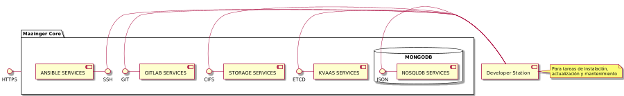

#  MAZINGER CORE (mazinger-core)
**PLATAFORMA DEVOPS PARA DESPLIEGUE AUTOMATIZADO DE INFRAESTRUCTURA**

Este proyecto tiene la intención de desarrollar una plataforma automatizada de displiegue de servidores y servicios, de fácil uso utilizando herramientas como: Ansible, Ansible AWX, Terraform, Vagrant Docker, Vault, Boundary, entre otras.

## INFRAESTRUCTURA

Para el Core de la plataforma de despliegue utilizaremos Ansible y Ansible AWX, por lo que necesitaremos instalar, previamente, algunos servidores de soporte o servicios a la plataforma:



**DEVELOPER STATION**

Es la computadora de desarrollo (estación o servidor) utilizada por el/los desarrolladores de la plataforma. Requiere que el usuario tenga la capacidad de escalar sus privilegios a nivel de superusuario.  Se requiere que al momento de lanzar el proceso de instalación inicial, el usuario se encuentre registrado con su usuario de desarrollo; el mismo será utilizado para configurar las credenciales como desarrollador/propietario de la plataforma o proyecto.

Nota: A la fecha (Ago 12, 2021), solo soportamos como estación de desarrollo Debian 10, Ubuntu 20 o Linux Mint.

**AWX CONTROLLER SERVER**

Este es un servidor basado en la versión libre de [RED HAT ANSIBLE AUTOMATION PLATFORM](https://www.ansible.com/products/automation-platform) conocida como [ANSIBLE AWX](https://github.com/ansible/awx) que eleva la automatización en toda su organización, ampliando sus posibilidades. Es una base más segura y flexible para construir e implementar la automatización que ayuda a su negocio a acelerar, orquestar e innovar.  

**AWX** proporciona una interfaz de usuario basada en web, una API REST y un motor de tareas construido sobre Ansible. Es uno de los proyectos iniciales de Red Hat Ansible Automation Platform. Para ambiente de producción (minimo), se requiere una maquina física o virtual con 4 cores/vcores, 8GB RAM y 100GB de almacenamiento.

**KVaaS SERVER (ETCD)**

Es el servidor de manejo de contraseñas, credenciales e información global y sensible configurado como un Key/value server. Se requiere que este configurado antes de ejecutar el proceso de instalación.

Nota: Si se cuenta con la infraestrctura esto puede ser escalado posteriormente a un etcd cluster. Solo es soportada la versión 3 del API.

**NO-SQL SERVER (MONGODB)**

Es el servidor de manejo de base de datos donde se gestiona la información de los usuarios de la plataforma, empresas a la que se le brinda servicio, colas de procesos, inventarios dinámicos, entre ootros.

Nota: Para reducir la cantidad de servidores a instalar y para dar mayor confiabilidad y disponibilidad nosotros desplegamos este servicio en un mongodb cluster ([ATLAS](https://account.mongodb.com)). 

**CIFS STORE SERVER**

Este es un servidor NAS/SAN que se utiliza para guardar las diferentes configuraciones y archivos para el uso de la plataforma y sus servicios. Es requerido el manejo de protocolo CIFS especialmente. Sin embargo, se requiere otros servicios como NFS y SFTP. Para obtener las prestaciones requeridas por este servidor, recomendamos la instalación de un bare metal o vps con [OPEN MEDIA VAULT](https://www.openmediavault.org/).

Nota: Para una mayor eficiencia y disponibilidad del servicio, nosotros adquirimos nuestra infraestructura de almacenamiento CIFS en [HETZNER STORAGE BOX](https://www.hetzner.com/storage/storage-box)


## INSTALACIÓN

### DEVELOPER STATION
Primero debe descargarse el proyecto desde nuestro repositorio en [GITHUB: maurorosero/mazinger-core](https://github.com/maurorosero/mazinger-core). Desde una sesión de consola (preferiblemente ambiente linux) en la computadora que vamos a usar como el **DEVELOPER STATION**, haciendo lo siguiente:

```bash
$ git clone https://github.com/maurorosero/mazinger-core.git
```
Asegurarse de tener python3 instalado en su versión más reciente e instalar/configurar ansible:

Para derivados de Debian (Debian, Ubuntu, Linux Mint, etc):
```bash
$ sudo apt update && sudo apt upgrade -y
$ sudo apt install python3
```
Para CentOS, Redhat, Fedora y derivados
```bash
$ sudo yum update -y
$ sudo yum install python3
```
Ahora, es el momento de instalar la versión más reciente de ansible
```bash
$ bin/setup_ansible.sh
```
Debes configurar la variable de ambiente DS_ROOT_FORWARD, para indicar a donde se redirigiran los correos de root, donde **root_forward** corresponde a la dirección de correo electrónico para el redireccionamiento **(ejemplo: user@example.com)**
```bash
$ export DS_ROOT_FORWARD='root_forward'
```
Una vez completado el paso anterior, debemos instalar las aplicaciones y librerias requeridas para el ambiente de desarrollo
```bash
$ bin/setup_stations.sh
```

### AWX CONTROLLER SERVER

Ahora vamos a configurar los parametros básicos de la plataforma y la empresa, para lo que debe llenar los datos que le serán solicitados.
```bash
$ bin/setup_configs.sh
```
Ahora vamos a instalar nuestro servidor de orquestación y controlador principal, que nos proveerá un interface gráfico y centralizdo para la gestión de nuestros procesos de autoatización, haciendo lo siguiente:
```bash
$ bin/setup_awx.sh
```

